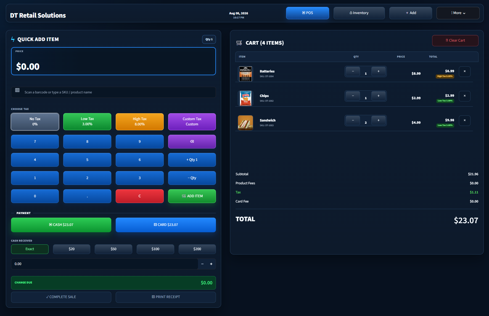
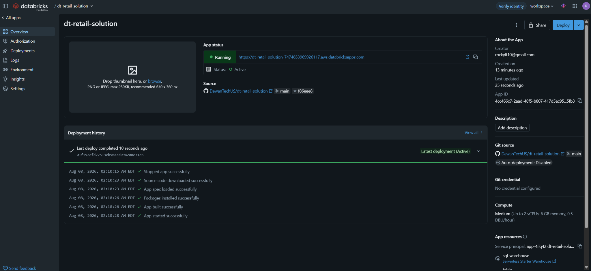
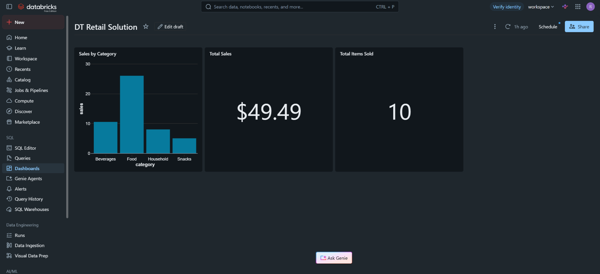

# DT Retail POS

A full retail point-of-sale and inventory management application built on **Databricks Apps**, **Databricks SQL**, **Delta Tables**, **Python**, and **Streamlit**.

DT Retail POS demonstrates an end-to-end retail workflow: product management, barcode/SKU search, cart checkout, configurable tax and fees, cash/card payments, inventory updates, sales history, product images, and printable receipts.

## Live Application

**Live Demo:**  
https://dt-retail-solution-7474653969926117.aws.databricksapps.com/#dt-retail-solution

> Access to the live Databricks application may depend on workspace permissions.

---

## Application Interface



The POS interface includes:

- Barcode, SKU, and product-name search
- Inventory suggestions
- Numeric quantity keypad
- Manual-price items
- Cart quantity controls
- Cash and card payment
- Cash received and change due
- Product fees
- No Tax / Low Tax / High Tax / Custom Tax
- Printable receipts
- Light and dark modes
- Inventory, Add Item, Manage, History, and Settings navigation

---

## Databricks Deployment



The application is deployed from the GitHub `main` branch to **Databricks Apps** and uses Databricks-managed resources for SQL and Unity Catalog data access.


---

## Databricks SQL Analytics Dashboard



In addition to the transactional POS application, the project includes a **Databricks SQL dashboard** for retail analytics.

The dashboard demonstrates:

- Sales by category
- Total sales
- Total items sold
- Databricks SQL visualization
- SQL-based retail reporting
- Dashboard publishing inside Databricks

This analytics layer complements the POS application by showing how the same retail data can be used for both **operational transactions** and **business reporting**.

---

## Key Features

### Point of Sale

- Search or scan by barcode
- Search by SKU
- Search by product name
- Inventory suggestions while typing
- Add multiple products to a cart
- Increase or decrease cart quantities
- Remove items from the cart
- Manual-price item support
- Cash and card checkout
- Automatic change calculation
- Printable receipt generation

### Inventory Management

- Add new products
- SKU and barcode support
- Product categories
- Stock quantities
- Product pricing
- Product-specific fees
- Product-specific tax configuration
- Product image upload
- Edit products
- Restock zero-stock items
- Delete products
- Add inventory items directly to the POS cart

### Tax and Fee Configuration

Supported tax modes:

- No Tax
- Low Tax
- High Tax
- Custom Tax
- Product Default Tax

Configurable POS settings:

- Low Tax %
- High Tax %
- Card Fee %

### Sales and History

- Automatic inventory reduction after checkout
- Sales transaction history
- Recently added inventory history
- Receipt IDs
- Sale timestamps
- Revenue tracking

---

## Technology Stack

| Technology | Purpose |
|---|---|
| Databricks Apps | Application hosting and deployment |
| Databricks SQL | Querying and transaction operations |
| SQL Warehouse | SQL compute |
| Delta Tables | Retail data storage |
| Unity Catalog | Governed table access |
| Python | Application and business logic |
| Streamlit | Web application interface |
| HTML / CSS | Custom POS styling |
| Pillow | Product image processing |
| Git / GitHub | Source control and deployment workflow |

---

## Architecture

```text
                    GitHub
                      |
                      | main branch
                      v
               Databricks Apps
                      |
                      v
              Streamlit POS App
                      |
                      v
          Databricks SQL Connector
                      |
                      v
                SQL Warehouse
                      |
          +-----------+-----------+
          |                       |
          v                       v
   Unity Catalog              POS Settings
   Delta Tables                  Table
          |
    +-----+----------------+
    |                      |
    v                      v
Inventory Table       Sales History Table
```

---

## Main Databricks Tables

### Inventory

`workspace.default.dt_retail_inventory`

Stores:

- SKU
- Barcode
- Product
- Category
- Quantity
- Price
- Item fee
- Tax type
- Custom tax rate
- Product image
- Added timestamp

### Sales History

`workspace.default.dt_retail_sales_history`

Stores completed transaction information, including sold products, quantities, prices, timestamps, and receipt data.

### POS Settings

`workspace.default.dt_retail_settings`

Stores configurable values such as:

- `LOW_TAX`
- `HIGH_TAX`
- `CARD_FEE`

---

## POS Workflow

```text
Search / Scan Product
        |
        v
Select Inventory Item
        |
        v
Add to Cart
        |
        v
Choose Quantity
        |
        v
Apply Tax / Product Fees
        |
        v
Choose Cash or Card
        |
        v
Complete Sale
        |
        +--------------------+
        |                    |
        v                    v
Update Inventory       Save Sales History
        |                    |
        +---------+----------+
                  |
                  v
            Generate Receipt
```

---

## Repository Structure

```text
dt-retail-solution/
|
|-- app.py
|-- app.yaml
|-- config.py
|-- database.py
|-- image_utils.py
|-- pos_service.py
|-- receipt.py
|-- requirements.txt
|-- styles.css
|-- retail_sales.sql
|-- README.md
|
`-- screenshots/
    |-- app-interface.png
    |-- databricks-deployment.png
    `-- databricks-sql-dashboard.png
```

---

## Running the Project

### 1. Clone the repository

```bash
git clone https://github.com/DewanTechUS/dt-retail-solution.git
cd dt-retail-solution
```

### 2. Databricks App Resources

The Databricks App uses resources for:

- SQL Warehouse
- Inventory Unity Catalog table
- Sales history Unity Catalog table
- Settings Unity Catalog table

The resource keys are referenced through `app.yaml`.

### 3. Deploy

In Databricks Apps:

```text
Deploy
→ From Git
→ Git reference: main
→ Reference type: Branch
→ Source code path: leave blank
→ Deploy
```

---

## Example Retail Calculations

Total inventory value:

```sql
SELECT
    SUM(quantity * price) AS inventory_value
FROM workspace.default.dt_retail_inventory;
```

Sales by category:

```sql
SELECT
    category,
    SUM(quantity * price) AS sales
FROM workspace.default.dt_retail_inventory
GROUP BY category;
```

---

## What This Project Demonstrates

This project demonstrates practical experience with:

- Databricks application development
- SQL and Delta Lake
- Unity Catalog
- Databricks SQL Warehouse
- Python application architecture
- Streamlit development
- POS business logic
- Inventory management
- Transaction processing
- Product search
- Configurable tax and fee logic
- Image handling
- Git-based deployment
- UI/UX design

---

## Author

**Dewan Mahmud**

**DewanTech** — *Technology Built with Purpose*
